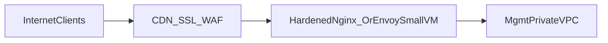

# Optional public edge for DDoS absorption (CDN / scrubbing)

Use when you must expose a **narrow** HTTPS surface that cannot live entirely behind WireGuard — for example a public-facing status dashboard or SSO callback shim.

Recommended stack:

## Controls

| Layer | Requirement |
|-------|--------------|
| DNS | TTL low only during rollout; apex behind CDN |
| ACL | CDN → origin allowlist egress IP ranges only |
| App | Separate origin token / mTLS stub between CDN and VPS |
| Autoscaling | None on tiny VPS unless budget for distributed edge |

Operational steps mirrored in IaC firewall variables — reduce UDP attack surface unrelated to bastion WG by never co-locate large public HTTP workloads on bastion VPN node.

## Terraform module (`ingress_edge`)

Production stack wires an **optional** compact edge VM:

- Module: [`infra/terraform/modules/ingress_edge`](../../infra/terraform/modules/ingress_edge)
- Toggle via `enable_ingress_edge` in [`prod/variables.tf`](../../infra/terraform/environments/prod/variables.tf)

After `terraform apply`, harden nginx upstream with Ansible (reverse proxy to approved internal service IP only). Do **not** expose GitLab Omnibus directly.

Latency cost: CDN hop `O(extra RTT)`, acceptable for ancillary tools.
